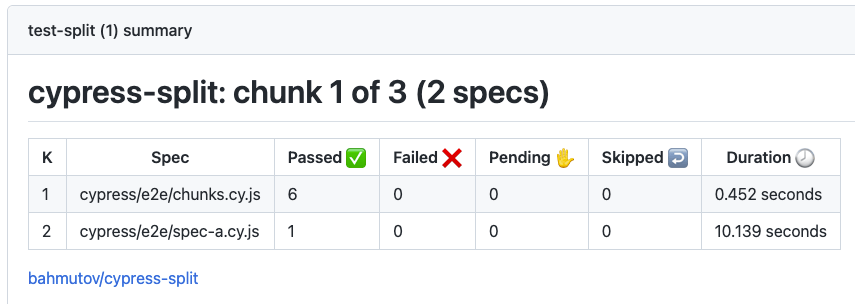
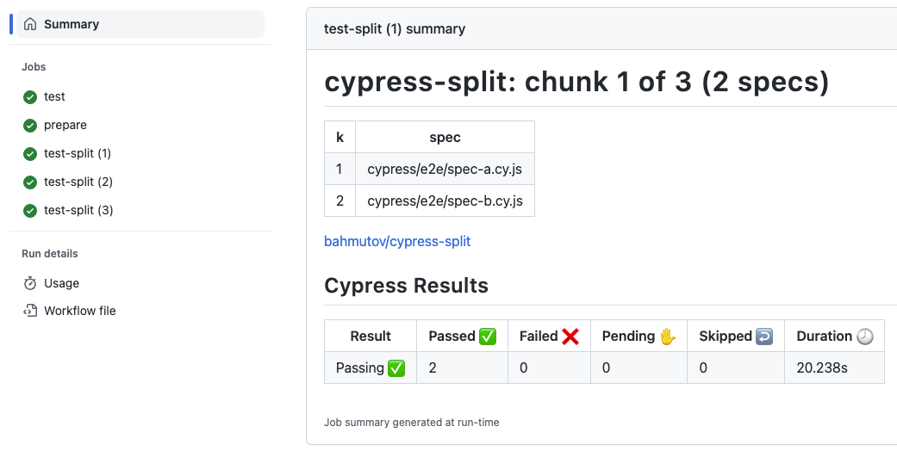

# cypress-split [](https://github.com/bahmutov/cypress-split/actions/workflows/ci.yml) [](https://dl.circleci.com/status-badge/redirect/gh/bahmutov/cypress-split/tree/main) 

> Split Cypress specs across parallel CI machines for speed
> without using any external services



📝 Read the blog post [Run Cypress Specs In Parallel For Free](https://glebbahmutov.com/blog/cypress-parallel-free/).

## Install

Add this plugin as a dev dependency and include in your Cypress config file.

```
# install using NPM
$ npm i -D cypress-split
# install using Yarn
$ yarn add -D cypress-split
```

Call this plugin from your Cypress config object `setupNodeEvents` method:

```js
// cypress.config.js
const { defineConfig } = require('cypress')
// https://github.com/bahmutov/cypress-split
const cypressSplit = require('cypress-split')

module.exports = defineConfig({
  e2e: {
    setupNodeEvents(on, config) {
      cypressSplit(on, config)
      // IMPORTANT: return the config object
      return config
    },
  },
})
```

**Important:** return the `config` object from the `setupNodeEvents` function.

### Cypress versions before v10

```js
// cypress/plugins/index.js
// https://github.com/bahmutov/cypress-split
const cypressSplit = require('cypress-split')

module.exports = (on, config) => {
  cypressSplit(on, config)
  // IMPORTANT: return the config object
  return config
})
```

Now update your CI script:

### GitLab CI

Run several containers and start Cypress using `--env split=true` parameter

```yml
stages:
  - build
  - test

install:
  image: cypress/base:16.14.2-slim
  stage: build
  script:
    - npm ci

test:
  image: cypress/base:16.14.2-slim
  stage: test
  parallel: 3
  script:
    - npx cypress run --env split=true
```

All specs will be split into 3 groups automatically. For caching details, see the full example in [gitlab.com/bahmutov/cypress-split-gitlab-example](https://gitlab.com/bahmutov/cypress-split-gitlab-example).

### CircleCI

```yml
parallelism: 3
command: npx cypress run --env split=true
```

See the full example in [bahmutov/cypress-split-example](https://github.com/bahmutov/cypress-split-example)

### GitHub Actions

```yml
# run 3 copies of the current job in parallel
strategy:
  fail-fast: false
  matrix:
    containers: [1, 2, 3]
steps:
  - name: Run split Cypress tests 🧪
    uses: cypress-io/github-action@v5
    # pass the machine index and the total number
    env:
      SPLIT: ${{ strategy.job-total }}
      SPLIT_INDEX: ${{ strategy.job-index }}
```



Note that we need to pass the `SPLIT` and `SPLIT_INDEX` numbers from the `strategy` context to the plugin to grab. See the full example in [bahmutov/cypress-split-example](https://github.com/bahmutov/cypress-split-example)

### Jenkins

Sample Jenkins File to run scripts on parallel:

```yml
pipeline {
  agent {
    // this image provides everything needed to run Cypress
    docker {
      image 'cypress/base:10'
    }
  }

  stages {
    // first stage installs node dependencies and Cypress binary
    stage('build') {
      steps {
        // there a few default environment variables on Jenkins
        // on local Jenkins machine (assuming port 8080) see
        // http://localhost:8080/pipeline-syntax/globals#env
        echo "Running build ${env.BUILD_ID} on ${env.JENKINS_URL}"
        sh 'npm ci'
        sh 'npm run cy:verify'
      }
    }

    stage('start local server') {
      steps {
        // start local server in the background
        // we will shut it down in "post" command block
        sh 'nohup npm run start &'
      }
    }

    // this stage runs end-to-end tests, and each agent uses the workspace
    // from the previous stage
    stage('cypress parallel tests') {
      environment {
        // Because parallel steps share the workspace they might race to delete
        // screenshots and videos folders. Tell Cypress not to delete these folders
        CYPRESS_trashAssetsBeforeRuns = 'false'
      }

      // https://jenkins.io/doc/book/pipeline/syntax/#parallel
      parallel {
        // start several test jobs in parallel, and they all
        // will use Cypress Split to load balance any found spec files
        stage('set A') {
          steps {
            echo "Running build ${env.BUILD_ID}"
            sh "npx cypress run --env split=2,splitIndex=0"
          }
        }

        // second thread runs the same command
        stage('set B') {
          steps {
            echo "Running build ${env.BUILD_ID}"
            sh "npx cypress run --env split=2,splitIndex=1"
          }
        }
      }

    }
  }

  post {
    // shutdown the server running in the background
    always {
      echo 'Stopping local server'
      sh 'pkill -f http-server'
    }
  }
}
```

### Other CIs

If you are running N containers in parallel, pass the zero-based index and the total number to the plugin using the environment variables `SPLIT_INDEX` and `SPLIT` or via [Cypress env option](https://on.cypress.io/environment-variables):

```
# using process OS environment variables
job1: SPLIT=3,SPLIT_INDEX=0 npx cypress run
job2: SPLIT=3,SPLIT_INDEX=1 npx cypress run
job3: SPLIT=3,SPLIT_INDEX=2 npx cypress run

# using Cypress env option
job1: npx cypress run --env split=3,splitIndex=0
job2: npx cypress run --env split=3,splitIndex=1
job3: npx cypress run --env split=3,splitIndex=2
```

## How does it work

This plugin finds the Cypress specs using [find-cypress-specs](https://github.com/bahmutov/find-cypress-specs) and then splits the list into chunks using the machine index and the total number of machines. On some CIs (GitLab, Circle), the machine index and the total number of machines are available in the environment variables. On other CIs, you have to be explicit and pass these numbers yourself.

```js
// it works something like this:
setupNodeEvents(on, config) {
  const allSpecs = findCypressSpecs()
  // allSpecs is a list of specs
  const chunk = getChunk(allSpecs, k, n)
  // chunk is a subset of specs for this machine "k" of "n"
  // set the list as the spec pattern
  // for Cypress to run
  config.specPattern = chunk
  return config
}
```

## List of specs

Suppose you want to run some specs first, for example [just the changed specs](https://glebbahmutov.com/blog/trace-changed-specs/). You would compute the list of specs and then call Cypress `run` command with the `--spec` parameter

```
$ npx cypress run --spec "spec1,spec2,spec3"
```

You can still split the specs across several machines using `cypress-split`, just move the `--spec` list (or duplicate it) to a process or Cypress env variable `spec`:

```
# using process environment variables split all specs across 2 machines
$ SPEC="spec1,spec2,spec3",SPLIT=2,SPLIT_INDEX=0 npx cypress run --spec "spec1,spec2,spec3"
$ SPEC="spec1,spec2,spec3",SPLIT=2,SPLIT_INDEX=1 npx cypress run --spec "spec1,spec2,spec3"

# using Cypress "env" option
$ npx cypress run --env split=2,splitIndex=0,spec="spec1,spec2,spec3"
$ npx cypress run --env split=2,splitIndex=1,spec="spec1,spec2,spec3"

# for CIs with automatically index detection
$ npx cypress run --env split=true,spec="spec1,spec2,spec3"
```

## Cucumber feature specs

Should work just the same, see the tested example in [bahmutov/cypress-split-cucumber-example](https://github.com/bahmutov/cypress-split-cucumber-example)

```js
// cypress.config.js
const { defineConfig } = require('cypress')
// https://github.com/bahmutov/cypress-split
const cypressSplit = require('cypress-split')
const cucumber = require('cypress-cucumber-preprocessor').default

module.exports = defineConfig({
  e2e: {
    setupNodeEvents(on, config) {
      cypressSplit(on, config)

      on('file:preprocessor', cucumber())
      // IMPORTANT: return the config object
      return config
    },
    specPattern: 'cypress/e2e/**/*.feature',
  },
})
```

## Debugging

To see diagnostic log messages from this plugin, set the environment variable `DEBUG=cypress-split`

## Small print

Author: Gleb Bahmutov &lt;gleb.bahmutov@gmail.com&gt; &copy; 2023

- [@bahmutov](https://twitter.com/bahmutov)
- [glebbahmutov.com](https://glebbahmutov.com)
- [blog](https://glebbahmutov.com/blog)
- [videos](https://www.youtube.com/glebbahmutov)
- [presentations](https://slides.com/bahmutov)
- [cypress.tips](https://cypress.tips)
- [Cypress Tips & Tricks Newsletter](https://cypresstips.substack.com/)
- [my Cypress courses](https://cypress.tips/courses)

License: MIT - do anything with the code, but don't blame me if it does not work.

Support: if you find a problem, open an issue in this repository. Consider [sponsoring my open-source work](https://github.com/sponsors/bahmutov).
